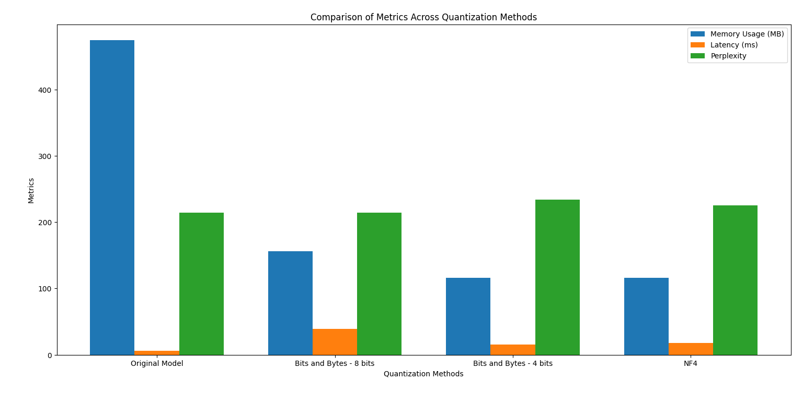

## Advanced Natural Language Processing - Assignment 4

### Quantization from Scratch
- Dataset Used - PennTree Bank dataset from datasets library
- Model Used - GPT2LMHeadModel

**Quantitative Insights**

**Analysis**
- Memory Usage - Whole-model quantization is highly effective for reducing memory usage, making it suitable for deployment in resource-constrained environments. However, selective quantization offers a balanced trade-off between memory savings and model quality.
- Inference Latency - Both quantization methods slightly reduce inference latency, with whole-model quantization offering a marginally better improvement. This reduction is modest, likely because latency bottlenecks are not heavily tied to model size alone.
- Perplexity - Perplexity increases significantly with quantization, with whole-model quantization showing the most degradation in model quality. Selective quantization offers better performance retention, making it preferable when model accuracy is a priority.

Whole-model quantization is optimal for memory efficiency but at the cost of significant accuracy loss. Selective quantization offers a middle ground, balancing memory savings and performance retention, making it suitable for tasks requiring moderate computational efficiency without sacrificing too much accuracy.

### BitsAndBytes Intergration and NF4 Quantization
- Dataset Used - PennTree Bank dataset from datasets library
- Model Used - GPT2LMHeadModel

**NF4 Method**
- NF4 (Nonlinear FP4) quantization uses a non-linear scale for quantizing values, as opposed to linear scales (used in methods like 8-bit or 4-bit quantization). This allows NF4 to allocate more precision to smaller values while sacrificing precision for outliers
- Linear Quantization assigns uniform step sizes across the range of values while Nonlinear Quantization adapts the step size, providing finer granularity for smaller numbers and coarser granularity for larger ones.

**Analysis**
- Both 4-bit and NF4 achieve significant memory savings compared to the original and 8-bit models. The memory footprint of NF4 matches that of 4-bit quantization, as both methods reduce the representation to 4 bits per value.
- The original model has the lowest latency due to the absence of quantization overhead. NF4 shows slightly higher latency than 4-bit but is still significantly faster than 8-bit quantization. 8-bit quantization introduces a notable slowdown, possibly due to the need to manage precision at higher bit levels and reconstruction during inference.
- 8-bit quantization maintains performance close to the original model, indicating minimal information loss. NF4 outperforms 4-bit quantization in perplexity, demonstrating its advantage in preserving accuracy despite using the same memory.
